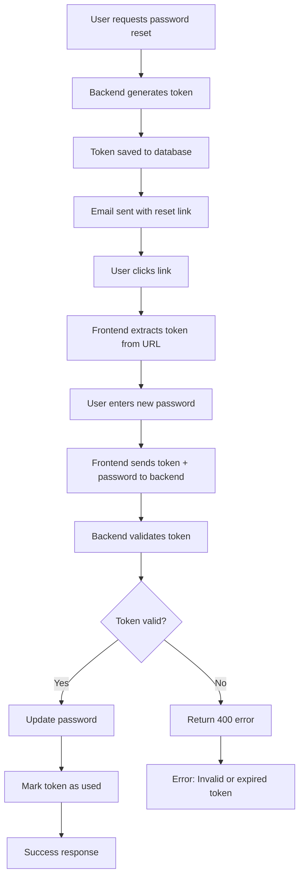

# 🔐 Password Reset Error Analysis & Solution

## 🚨 **Error Summary**
```
Failed to load resource: the server responded with a status of 400 (Bad Request)
ResetPassword.tsx:117 [ResetPassword] Response: 400 Object
ResetPassword.tsx:123 [ResetPassword] Password reset failed: Invalid or expired reset token
```

## 🔍 **Root Cause Analysis**

### **1. Most Common Causes:**

#### **A. Token Expiration (Most Likely)**
- **Issue**: Password reset tokens expire after 1 hour
- **Cause**: User waited too long between requesting reset and using the link
- **Solution**: Request a new password reset

#### **B. Token Already Used**
- **Issue**: Token was already used to reset password
- **Cause**: User clicked the reset link multiple times or already completed the reset
- **Solution**: Request a new password reset

#### **C. Database Connection Issues**
- **Issue**: Backend cannot connect to PostgreSQL database
- **Cause**: Database server not running or connection configuration incorrect
- **Solution**: Ensure PostgreSQL is running and properly configured

#### **D. Email Service Issues**
- **Issue**: Reset email not sent or contains invalid token
- **Cause**: Email service configuration problems
- **Solution**: Check email service configuration

### **2. Technical Flow Analysis:**



## 🛠️ **Debugging Steps**

### **Step 1: Use the Debug Tool**
I've created a comprehensive debugging tool for you:

**File**: `debug-password-reset-complete.html`

**How to use**:
1. Open the file in your browser
2. Run each step sequentially
3. Check the logs for detailed information

### **Step 2: Check Backend Logs**
The backend now has enhanced logging. Look for these log messages:

```
🔐 [Reset Password] Request received: { token: "abc123...", hasPassword: true }
🔍 [Reset Password] Looking up token in database...
❌ [Reset Password] Token not found or expired
🔍 [Reset Password] Token found but invalid: { used: true, expires_at: "2024-01-01T10:00:00Z" }
```

### **Step 3: Verify Database**
Check if the `password_reset_tokens` table exists and has data:

```sql
-- Connect to your PostgreSQL database
SELECT * FROM password_reset_tokens ORDER BY created_at DESC LIMIT 5;
```

## 🔧 **Solutions**

### **Solution 1: Request New Password Reset**
1. Go to the login page
2. Click "Forgot your password?"
3. Enter your email address
4. Check your email for the new reset link
5. Use the new link immediately (within 1 hour)

### **Solution 2: Check Database Connection**
1. Ensure PostgreSQL is running
2. Check database credentials in `.env` file
3. Verify the `password_reset_tokens` table exists

### **Solution 3: Clear Expired Tokens**
If you have database access, you can clear expired tokens:

```sql
DELETE FROM password_reset_tokens WHERE expires_at < NOW() OR used = true;
```

### **Solution 4: Test Email Service**
Use the debug tool to test if emails are being sent correctly.

## 📋 **Prevention Measures**

### **1. User Education**
- Inform users that reset links expire in 1 hour
- Advise users to check spam folder
- Tell users to use the link immediately

### **2. Technical Improvements**
- Add token validation endpoint
- Implement token refresh mechanism
- Add better error messages
- Implement rate limiting

### **3. Monitoring**
- Log all password reset attempts
- Monitor token usage patterns
- Track email delivery success rates

## 🧪 **Testing the Fix**

### **Test 1: Complete Flow**
1. Request password reset
2. Check email immediately
3. Click reset link
4. Enter new password
5. Verify success

### **Test 2: Expired Token**
1. Request password reset
2. Wait 2 hours
3. Try to use the link
4. Verify "expired token" error

### **Test 3: Used Token**
1. Request password reset
2. Use the link successfully
3. Try to use the same link again
4. Verify "invalid token" error

## 📊 **Error Codes Reference**

| Error Code | Meaning | Solution |
|------------|---------|----------|
| 400 | Bad Request | Check token and password format |
| 404 | User not found | Verify email address |
| 500 | Server error | Check backend logs and database |

## 🎯 **Quick Fix Checklist**

- [ ] Backend server is running on port 5000
- [ ] PostgreSQL database is running
- [ ] Email service is configured
- [ ] User exists in database
- [ ] Token is not expired (less than 1 hour old)
- [ ] Token has not been used before
- [ ] Frontend and backend are on same network

## 🚀 **Next Steps**

1. **Use the debug tool** to identify the exact issue
2. **Check backend logs** for detailed error information
3. **Request a new password reset** if token is expired
4. **Verify database connection** if tokens are not being found
5. **Test email service** if emails are not being received

## 📞 **Support**

If the issue persists after following these steps:

1. Check the backend console logs
2. Use the debug tool to identify the specific failure point
3. Verify all services are running correctly
4. Check network connectivity between frontend and backend

The enhanced logging will now provide detailed information about what's happening during the password reset process, making it much easier to identify and fix the issue.
